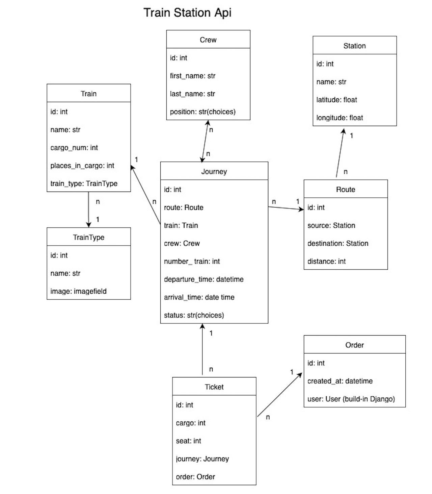

# 🚉 Train Station Api

API service for train station management written on DRF.

# Installing using GitHub

Install PostgresSQL and create db

```bash
git clone https://github.com/Iryna802498/train-station.git
cd train-station
python -m venv venv
venv\Scripts\activate (on Windows)
source venv/bin/activate (on macOS)
pip install -r requirements.txt
```

For Windows:

```bash
set POSTGRES_DB=your_db_name
set POSTGRES_USER=your_db_user
set POSTGRES_PASSWORD=your_db_password
set POSTGRES_PORT=5432
set POSTGRES_HOST=your_db_host
set SECRET_KEY=your_secret_key
set DEBUG=True
```

For Linux/macOS:

```bash
export POSTGRES_DB=your_db_name
export setPOSTGRES_USER=your_db_user
export POSTGRES_PASSWORD=your_db_password
export POSTGRES_PORT=5432
export POSTGRES_HOST=your_db_host
export SECRET_KEY=your_secret_key
export DEBUG=True
```

```bash
python manage.py migrate
python manage.py createsuperuser (create with your credentials)
python manage.py runserver
```

# Run with docker

Docker should be installed

```bash
docker-compose build
docker-compose up
```

# Getting access

- create user via api/user/register/
- get access token api/user/token/

# Features

- JWT authenticated
- Admin panel /admin/
- Documentation is located at /api/doc/swagger/
- Managing orders and tickets
- Creating journey with route, train, train number, crew, departure time and arrival time
- Creating stations
- Filtering journey by source name, destination name, train name, departure time and arrival time

# DB structure

